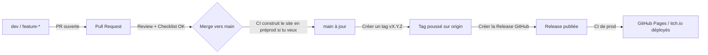

# 📥 Pull Request – Checklist pour Ether

Merci de contribuer à Ether ! Avant de merger, compléte la partie Notes et vérifie la checklist ci-dessous 👇

---

## 📝 Notes
_(Contexte des changements, décisions de design, TODO pour plus tard…)_

## ✅ Checklist

- [ ] **Version mise à jour** dans `docs/Ether.md`  
- [ ] **CHANGELOG.md** mis à jour  
    - Numéro de version correct (PATCH / MINOR / MAJOR)  
    - Contenu de `[Unreleased]` déplacé dans une nouvelle section  
    - `[Unreleased]` vidé pour la suite  
    - Catégories respectées : Ajouté / Changé / Corrigé / Supprimé  
- [ ] **README.md** mis à jour si besoin  
- [ ] **LICENSE.md** mis à jour si nécessaire  
- [ ] **GitHub Pages**  
    - [ ] Le site fonctionne en local  
    - [ ] Le site fonctionne via CI  

## 🚀 Publier une nouvelle version

### Flowchart de publication

### Étapes

1. Développement sur une branche `dev` ou `feature-*`  
2. Avant la release : mettre à jour les numéros de versions et le `CHANGELOG.md`  
3. Ouvrir la PR → passer la checklist → review + merge via PR (pas de push direct sur `main`)  
4. Mettre à jour `main` en local (`git checkout main && git pull`)  
5. Créer et pousser le tag (`git tag vX.Y.Z && git push origin vX.Y.Z`)  
6. Créer la Release GitHub (copier la section du `CHANGELOG.md`)  
7. Déploiements automatiques (GitHub Pages / itch.io quand configuré)  
